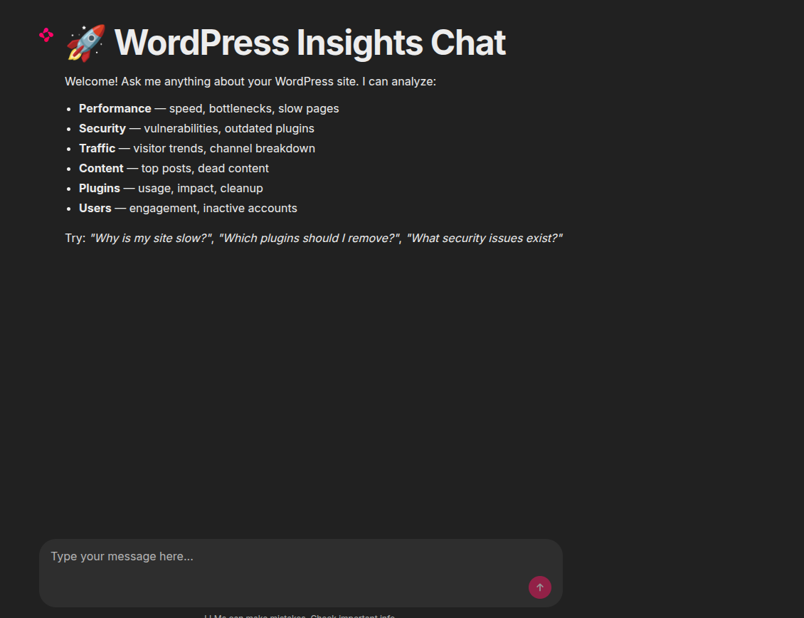
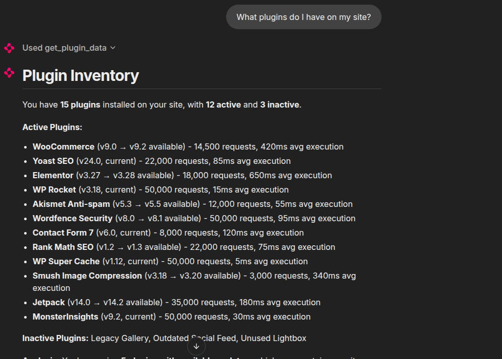
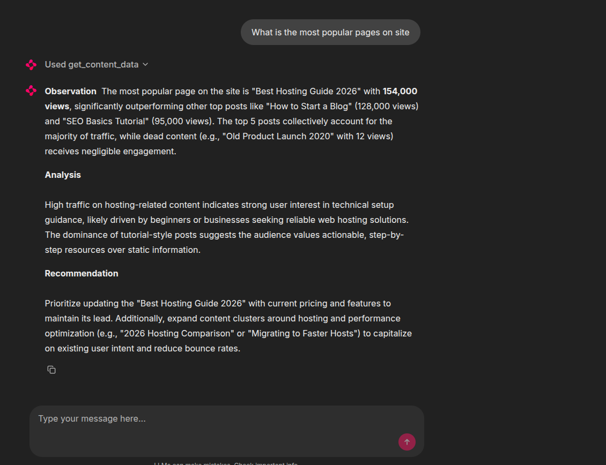
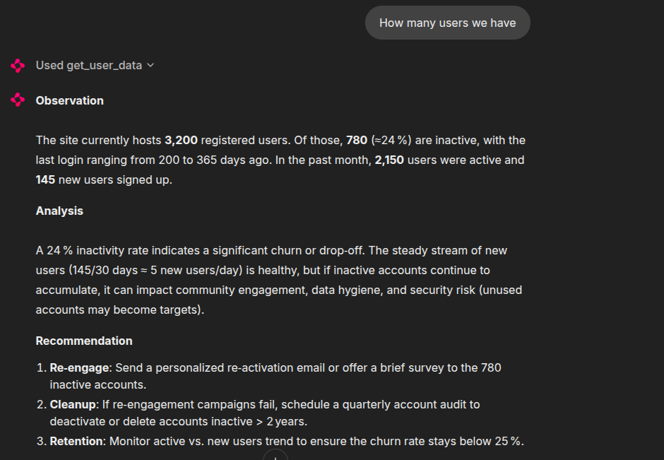
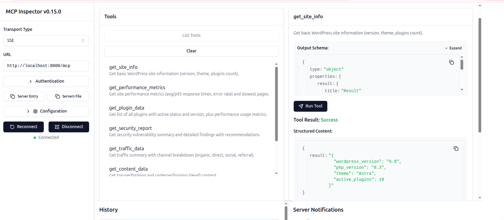

# Demo

WordPress Insights Chat is an AI-powered analytics platform that understands your WordPress site through natural language conversations.

## Chat Interface

Ask questions about your site's performance, security, traffic, content, plugins, and users — just like talking to a WordPress expert.

## Example: Plugin Analysis

Ask *"What plugins do I have on my site?"* and get a detailed breakdown of all plugins, their versions, and status.

## Example: Page Performance

Ask about page performance and get insights on slow pages, bottlenecks, and recommendations.

## Example: User Analytics

Ask about user engagement and discover inactive accounts.

## MCP Integration

The platform also exposes all tools via the Model Context Protocol (MCP). Connect any MCP-compatible client to `http://localhost:8000/mcp` for programmatic access.

